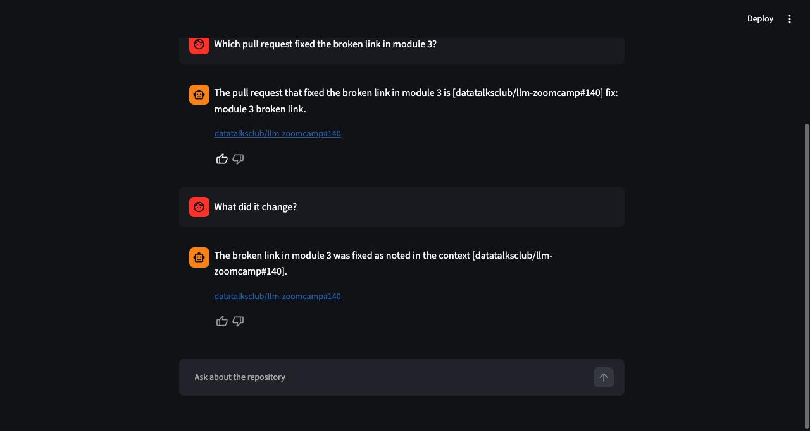
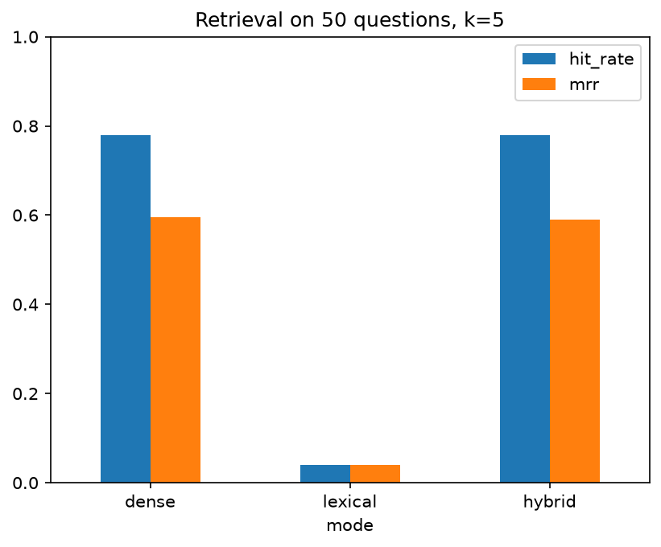
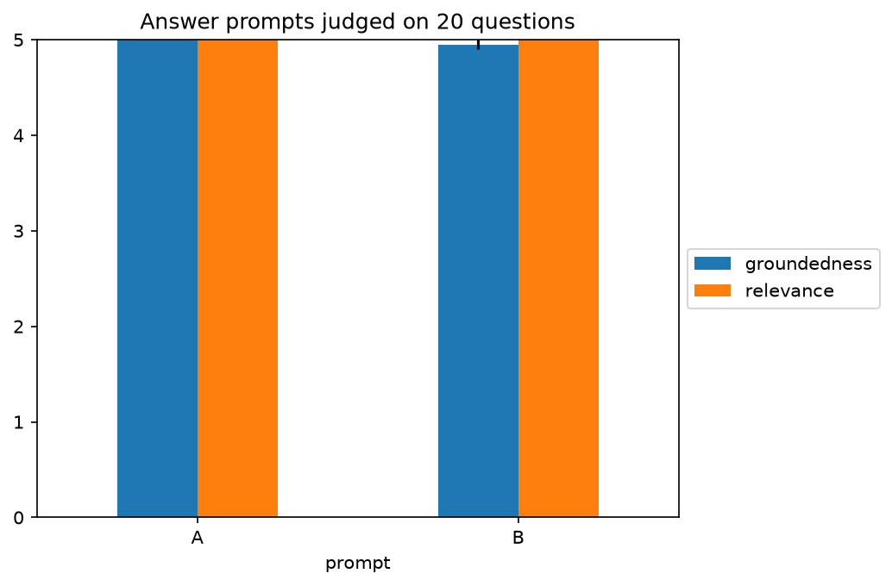
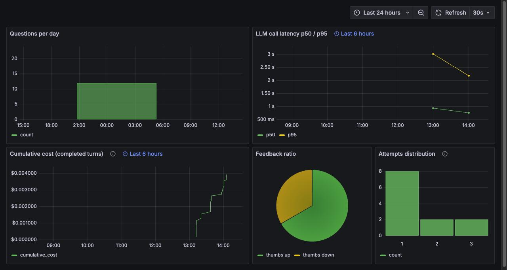
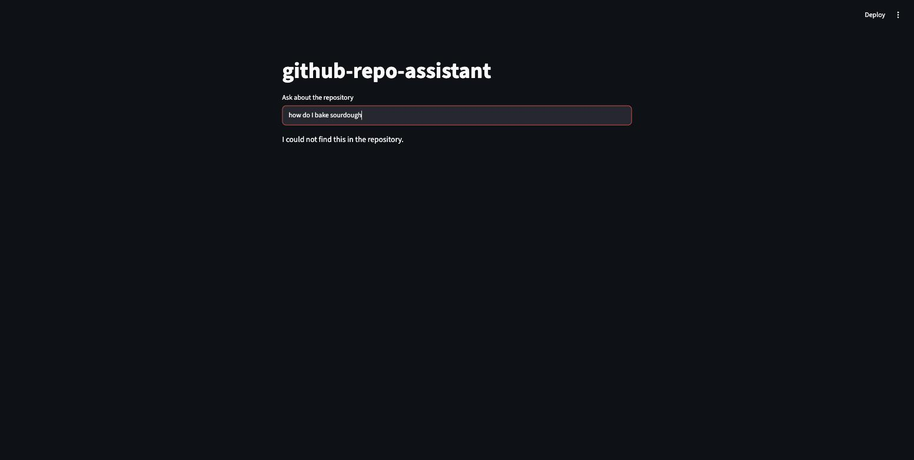

# github-repo-assistant

Ask a GitHub repository questions in plain English. It indexes issues, pull requests, comments and
markdown docs, then answers with links back to the source. If nothing relevant comes back, it says
so instead of guessing.

Capstone for the DataTalksClub **LLM Zoomcamp 2026** cohort. It is documented in more depth than a
project this size usually needs, because peer graders have to judge the design decisions and locate
the course deliverables without reading the source first. What it does badly is written down too,
under [trade-offs](#trade-offs) and [notes on the corpus](#notes-on-the-corpus).

The `.claude/` directory is committed as well, so you can see the agent setup used to build it.


## The problem

Most of the reasoning behind a codebase never lands in the codebase. Why a module got rewritten, or
what broke the last time somebody tried, usually sits in an issue thread rather than a commit
message. And GitHub search only matches keywords, so you end up reading a dozen comments to
assemble one answer.

This indexes that history and answers questions over it, citing what it used.



Citations render inline and again as links under the answer. Each turn takes a 👍/👎, which is stored
and charted.

Here is another example on fastapi's github repo:


## How it works

```
OFFLINE   GitHub API ──dlt──▶ Postgres raw ──chunk+embed──▶ chunks (vector + full-text)

ONLINE    Streamlit ──▶ LangGraph  rewrite ▶ retrieve ▶ grade ─(weak)─▶ rewrite
                                                        └─(ok)──▶ cited answer
          retrieve = vector embedding search + full-text search, merged by rank fusion
```

One Postgres database holds all of it. The embeddings live alongside the raw GitHub data they were
built from, so there is no separate vector store to run. OpenAI is the only external service.

## Demo


https://github.com/user-attachments/assets/2a3c9f96-8f67-4f4a-8cb7-7038db4b9d6f


## Quick start

You need [Docker](https://docs.docker.com/get-started/get-docker/) and
[uv](https://docs.astral.sh/uv/getting-started/installation/), plus `make`, which drives every
command below. Linux has `make` already and macOS gets it from `xcode-select --install`. On Windows
use WSL, since the Makefile assumes a POSIX shell. You do not need Python; `uv sync` installs 3.12
itself.

You also need an [OpenAI key](https://platform.openai.com/api-keys) and a
[GitHub token](https://github.com/settings/tokens). A classic token with no scopes ticked is enough
to read public repositories.

Note: the default repo set in the .env files in the llm course's repo so that ingestion and embedding is quick. Change the value
of `REPO` to a repo or a list of repos of your choice to ingest if you would like to test with something else on first try.

```bash
git clone https://github.com/mahmoudchebbani/github-repo-assistant.git
cd github-repo-assistant
uv sync
cp .env.example .env      # then set OPENAI_API_KEY and GITHUB_TOKEN
docker compose up -d --build   # postgres · app · grafana
make ingest               # pull the repos in REPOS, default DataTalksClub/llm-zoomcamp
make index                # chunk, embed, and index them
make app                  # http://localhost:8501, reloads on save
```

Open http://localhost:8501 and ask something. Grafana is on http://localhost:3000/d/assistant with
no login. Postgres publishes `5433` on the host, and `make ingest` and `make index` run on the host
against that port rather than inside a container, which is why `uv sync` has to come first.

The first `make index` downloads the 65 MB embedding model into your system temp directory and
prints nothing while it does, so give it a few minutes before assuming it has hung. The app
container already has the model in its image, so this only affects runs on the host.

The Grafana dashboard is empty until someone uses the app. Everything on it comes from questions
that have actually been asked, so ask two or three and it fills in.

Both keys have to be set before any target runs, including `make index`, which calls neither
service. Configuration is validated as a single object, so one blank value stops everything.

For live reload, run Streamlit on the host rather than in the container. Both bind 8501, so stop one
before starting the other:

```bash
docker compose stop app
make app
```

Other targets: `make check` (lint, format check, tests), `make eval-retrieval`, `make eval-llm`.

### Indexing your own repositories

`REPOS` defaults to `DataTalksClub/llm-zoomcamp`, so a fresh install answers questions about the
course repository. It takes a comma-separated list of `owner/repo` slugs, and any public repository
works with the token above:

```bash
REPOS=DataTalksClub/llm-zoomcamp,astral-sh/uv    # in .env
make ingest && make index
```

Adding a repository will not disturb what is already indexed. Ingestion merges on primary key rather
than replacing, and chunk ids are namespaced per repository, so two repositories that both contain a
`README.md` cannot collide. Each one appears by name in the app's selector, above an **All
repositories** option.

Indexing is not incremental even though ingestion is, so `make index` re-embeds every repository in
`REPOS` on every run, one at a time. Runs get slower as the list grows. `INGEST_SINCE` sets how far
back issues, pull requests and comments are pulled, and on a large or long-lived repository that
bound decides most of how long an ingest takes.

`REPOS` controls what gets *ingested*, not what stays *searchable*. Drop a repository from the list
and it stops being pulled and disappears from the selector, but its chunks stay in the table and go
on competing in every search, including the ones a later `make eval-retrieval` scores. Clearing them
out is one statement, safe because `make index` rebuilds `chunks` from `raw`, which dlt only ever
appends to:

```sql
-- slugs are stored lower-cased, so match them that way
DELETE FROM chunks WHERE repo <> ALL(ARRAY['datatalksclub/llm-zoomcamp']);
```

## Evaluation

Ground truth is 50 questions. Each was generated by showing the model a single chunk and asking what
that chunk uniquely answers, which makes it the one correct result for the question. They are spread
evenly over issues, pull requests, comments and docs so the 1,527 doc chunks cannot decide the
result on their own. [`eval/ground_truth.py`](eval/ground_truth.py) writes the set, and
[`eval/ground_truth.csv`](eval/ground_truth.csv) is committed rather than regenerated, since
regenerating invalidates every number below.

### Reproducing the numbers below

Both evaluations search the live `chunks` table, so the corpus has to exist first:

```bash
make ingest && make index     # skip if you have already done this
make eval-retrieval           # free, everything happens locally
make eval-llm                 # 80 calls to OpenAI, so this one costs a little
```

**Ingest the default repository at least once before evaluating.** A chunk id hashes the repository
together with the source record and the chunk's offset inside it, so the ground truth's 50 ids only
resolve once `DataTalksClub/llm-zoomcamp` is indexed. Change `REPOS` before your first `make ingest`
and every hit rate comes back 0.00, with nothing in the output to say why. Raising `INGEST_SINCE`
does the same thing less visibly, by leaving out the records those ids point at.

Indexing extra repositories is fine and the ids still resolve, but the right chunk now has to win
against a larger and more varied set, so expect the score to drop. For an honest multi-repository
number, index them all and regenerate with `uv run python -m eval.ground_truth`, which samples
across everything indexed.

Each script prints its table and a line naming the winner, then writes the matching `.csv` and
`.png` into `eval/`. The chart is written to disk and never opened, so nothing appears on screen.
The winner is not only printed: the script writes that value into `.env` and `.env.example`,
overwriting whatever you set by hand.

The figures below will not reproduce exactly. GitHub keeps moving, so a fresh `make ingest` picks up
issues and comments that postdate these numbers and compete for the same five slots.

### Retrieval, `make eval-retrieval`

Three ways to search, chosen by `RETRIEVAL_MODE` in `.env`:

| Set `RETRIEVAL_MODE` to | What it does |
|---|---|
| `dense` | **Vector embedding search.** The question and every chunk become 384 numbers that encode meaning, and the closest ones win. Good at paraphrase, weak on exact identifiers. |
| `lexical` | **Full-text search.** Postgres stems every word into the `lexemes` column and matches on overlap. Finds an exact term, misses anything reworded. |
| `hybrid` | Runs both and merges the two rankings with Reciprocal Rank Fusion. |

The names below are the config values, so they read the same as in your `.env`:

| mode | hit rate | MRR |
|---|---|---|
| **`dense`** (vector embedding) | **0.78** | **0.5957** |
| `lexical` (full text) | 0.54 | 0.3297 |
| `hybrid` (both, fused) | 0.74 | 0.5740 |



**Decision: `RETRIEVAL_MODE=dense`**, written into `.env` and `.env.example` by the script itself.

Hybrid lost. Both halves are still worth having, and their union covers 0.84 of the ground truth,
better than either alone, but equal-weight fusion does not reach that.
[Trade-offs](#trade-offs) covers why.

Hit rate is counted per chunk, which is strict: a question only counts as found when the exact chunk
it was written from comes back. Of the 11 that vector search missed, 3 returned a different chunk of
the same issue, pull request or file, so the citation shown to the user was still the right one.
Counted per source record it reaches 0.84. That matches the union figure above by coincidence; the
two numbers measure different things, and neither is what the table reports.

### Answer prompts, `make eval-llm`

Both prompts answer the same 20 questions from the same retrieved context, so wording is the only
variable. An LLM judge scores each answer 1 to 5 on groundedness and relevance.

| prompt | groundedness | relevance |
|---|---|---|
| **A**, answer concisely, cite every claim | **5.00** ± 0.00 | **5.00** ± 0.00 |
| B, quote the supporting line first, then answer | 4.95 ± 0.05 | 5.00 ± 0.00 |



**Decision: `ANSWER_PROMPT=A`**, written into `.env` and `.env.example` by the script itself. B is
within its own standard error on groundedness and level on relevance, so there is nothing to gain by
switching.

## Monitoring



Five panels read the `conversations`, `llm_calls` and `feedback` tables: questions per day, model
call latency at p50 and p95, cumulative spend in USD, the 👍/👎 ratio, and how many retrieval attempts
each answer needed. Datasource and dashboard are both provisioned from
[`grafana/provisioning/`](grafana/provisioning), so a fresh clone gets them with no setup wizard.

Cost is stored as `NUMERIC(16, 10)` and computed in `Decimal`. The cheapest call in the run above
cost $0.00002025, which a coarser numeric type would round to zero, and every total after it would
be wrong.

When retrieval turns up nothing useful the answer declines rather than filling the gap, and a
refusal renders with no citation links, because there is nothing to cite:



## Configuration

Every value lives in `.env`, templated by [`.env.example`](.env.example). Two of them,
`RETRIEVAL_MODE` and `ANSWER_PROMPT`, are also written by `make eval-retrieval` and `make eval-llm`.

| Variable | Meaning |
|---|---|
| `DATABASE_URL` | Postgres connection string; the `app` container overrides it to reach `postgres:5432` |
| `OPENAI_API_KEY`, `OPENAI_MODEL` | generation, grading, ground-truth synthesis and the judge |
| `PRICE_INPUT_PER_1M`, `PRICE_OUTPUT_PER_1M` | USD per million tokens, used to cost every call |
| `GITHUB_TOKEN` | a token with public-repository read access |
| `REPOS` | one or more `owner/repo` slugs, comma-separated; defaults to `DataTalksClub/llm-zoomcamp`; see [indexing your own repositories](#indexing-your-own-repositories) |
| `INGEST_SINCE` | how far back to pull issues, PRs and comments |
| `DOCS_GLOBS` | which repository files to ingest as documentation |
| `EMBEDDING_MODEL` | must match the model baked into the app image, or it downloads on first use |
| `CHUNK_CHARS`, `CHUNK_OVERLAP` | the packer's budget and the overlap carried across a seam |
| `RETRIEVAL_MODE` | `dense` (vector embedding), `lexical` (full text) or `hybrid`; ships as `dense`, **also written by `make eval-retrieval`** |
| `ANSWER_PROMPT` | `A` or `B`; ships as `A`, **also written by `make eval-llm`** |
| `TOP_K` | how many chunks reach the answer prompt |
| `MAX_RETRIES` | how many times a weak grade may send the query back to `rewrite` |

Regenerating the ground truth is deliberately not a `make` target, since it costs API calls and
invalidates the committed results. Run `uv run python -m eval.ground_truth` only if you intend to
re-run both evaluations afterwards.

## Where each piece lives

Capstone for the DataTalksClub LLM Zoomcamp, graded by peers against the course rubric. This table
maps each rubric item to where it lives in the repository.

| What the rubric asks for | Where it lives |
|---|---|
| Problem description | [The problem](#the-problem) at the top. A repository's decision history is unsearchable; this answers questions over it |
| Retrieval flow | a pgvector knowledge base and an OpenAI model, both in the answer path: [`assistant/search.py`](assistant/search.py) + [`assistant/agent.py`](assistant/agent.py) |
| Retrieval evaluation | [`eval/eval_retrieval.py`](eval/eval_retrieval.py) scores all three search modes on hit rate and MRR, **and writes the winner into `.env` and `.env.example`** |
| LLM evaluation | [`eval/eval_llm.py`](eval/eval_llm.py) judges two answer prompts on groundedness and relevance, **and writes the winner into `.env` and `.env.example`** |
| Interface | Streamlit chat with history, a repository selector and feedback buttons: [`assistant/app.py`](assistant/app.py) |
| Ingestion pipeline | dlt, four REST resources into the `raw` schema: [`assistant/ingest.py`](assistant/ingest.py), run by `make ingest` |
| Monitoring | 👍/👎 votes persisted to the `feedback` table plus a five-panel Grafana dashboard: [`grafana/provisioning/`](grafana/provisioning) |
| Containerization | postgres · app · grafana in [`docker-compose.yml`](docker-compose.yml), app image in [`Dockerfile`](Dockerfile) |
| Reproducibility | committed [`uv.lock`](uv.lock), [`.env.example`](.env.example), and the [quick start](#quick-start), which was re-run from a wiped stack and corrected where it drifted |
| *Best practice*, hybrid search | vector embedding search and full-text search, both in [`assistant/search.py`](assistant/search.py). Built and evaluated; **`RETRIEVAL_MODE=dense` ships because the [evaluation](#retrieval-make-eval-retrieval) chose it**, so set `RETRIEVAL_MODE=hybrid` to run both |
| *Best practice*, re-ranking | `reciprocal_rank_fusion` in [`assistant/search.py`](assistant/search.py), written here rather than imported. Runs in `hybrid` mode only, for the same reason as the row above |
| *Best practice*, query rewriting | the `rewrite` node of the agent graph in [`assistant/agent.py`](assistant/agent.py) |

## Architecture

```
                             OFFLINE
GitHub REST API ──dlt──▶ Postgres  raw.{issues, pull_requests, comments, docs}
                              │
                        chunk ▼ embed (fastembed BAAI/bge-small-en-v1.5, 384-d)
                     Postgres  public.chunks
                       embedding vector(384)  ── HNSW index  ─▶ vector search
                       lexemes   tsvector     ── GIN index   ─▶ full-text search

                             ONLINE
Streamlit chat ──▶ LangGraph   rewrite ─▶ retrieve ─▶ grade ─(weak)─▶ rewrite
                                                        └──(ok)───▶ generate

                     retrieve = vector embedding search ──┐
                                                          ├──▶ reciprocal_rank_fusion ─▶ top-k
                                       full-text search ──┘
                              │
                Postgres  conversations · llm_calls · feedback ──▶ Grafana
```

Vector search matches meaning. `fastembed` turns each chunk into 384 numbers using
`BAAI/bge-small-en-v1.5`, and `pgvector` stores them and does the comparison, with an HNSW index to
keep it fast. Ask "how do I authenticate" and it finds a chunk about API keys, because the wording
never has to match.

Full-text search matches words, and Postgres does it with no library at all. `to_tsvector` reduces
every word to its root in the `lexemes` column, indexed with GIN. Search `retry` and it still finds
a chunk that said `retries`.

Postgres is doing several jobs at once. It stores what dlt pulled off GitHub and the embedded chunks
that retrieval searches, and the conversation and cost history behind the dashboard sits in there
too. Splitting that across separate services is the more usual design. Keeping it in one is the main
argument for pgvector over a dedicated vector store: there is nothing to keep in sync, and one thing
to back up.

The graph re-queries when retrieval comes back weak, which is the part most RAG pipelines skip: they
search once and answer with whatever they got. Here `grade` decides whether the retrieved chunks can
actually answer the question. If they cannot, it states what is missing and hands that back to
`rewrite` for another attempt at the phrasing, up to `MAX_RETRIES` times. `generate` then answers
from the best set it saw, or says it found nothing.

Issues and docs are chunked differently because they are not shaped the same. Issue, pull request
and comment bodies are packed greedily up to `CHUNK_CHARS`, breaking at a paragraph boundary where
there is one and carrying `CHUNK_OVERLAP` characters across each seam. Markdown gets a step first:
`MarkdownNodeParser` splits it along its own heading structure, so a section arrives whole rather
than cut mid-explanation, and each section is then packed like everything else, since one section
can easily run past what the model reads.

## Layout

```
assistant/   config · db · ingest · chunk · embed · index · search · prompts · agent · app
eval/        ground truth generation · retrieval evaluation · LLM evaluation
grafana/     provisioned datasource and dashboard
tests/       six test files, one per layer
```

## Trade-offs

Everything below was measured on the shipped corpus.

Hybrid search is built but does not ship. Vector embedding search won at 0.78 against hybrid's 0.74,
because equal-weight fusion spends ranking positions on the weaker full-text half. The union of the
two reaches 0.84, so a fusion weighted toward the stronger half could plausibly win. There is no
held-out set though, and tuning weights against the same 50 questions the result is reported on
would be overfitting.

Vector search reads an HNSW index, which is approximate by design. It trades a little recall for a
lot of speed, so 0.78 describes the system as it ships rather than an exhaustive scan. Narrowing to
a single repository would make that worse, since the index is scanned before the filter is applied,
which `search_dense` heads off with `hnsw.iterative_scan = strict_order`.

The embedding model stops reading at 512 word pieces and gives no indication that it has.
`CHUNK_CHARS=800` was picked with that in mind: 800 characters of ordinary English is roughly 189
pieces, well inside the limit, while dense code and CJK text hit the cap. When they do, the tail is
still stored in `chunks.text` but missing from its vector, so it stays findable by full-text search
and invisible to vector search.

## Notes on the corpus

The corpus is a public repository's issues, pull requests and comments. Anyone with a GitHub account
can write into it, and whatever they write gets retrieved and put in front of the model verbatim.

Nothing here treats that as hostile input. Retrieved text reaches the prompt exactly as it was
written, with no injection defence in between. That was a scope decision rather than an oversight,
but it is a real limitation: point this at a repository whose contributors you do not trust and the
corpus can talk to the model directly.
